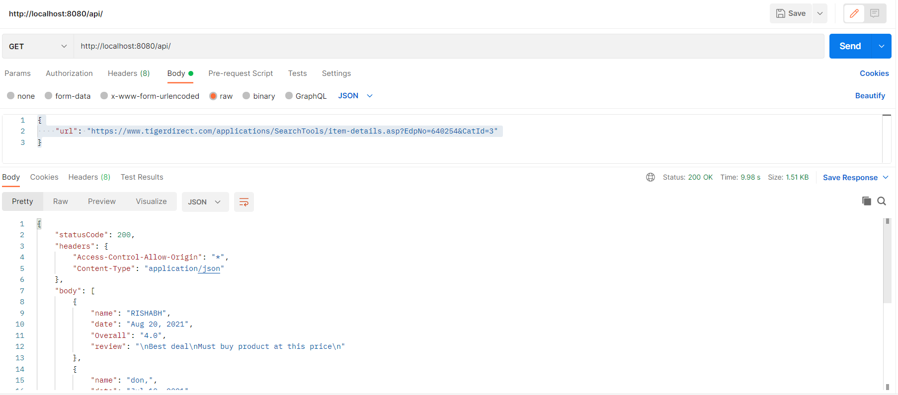

# Web crawler

This web crawler is designed to crawl reviews from **https://www.tigerdirect.com/**. with the help of nodejs and puppeteer.
As a end user api is provided that will crawl all the reviews from particular product page provided in api body.



# How to run locally?

```
npm run start
```

Server will be started on
**http://localhost:8080/**

## API endpoint

```
http://localhost:8080/api/
body= {
"url": "https://www.tigerdirect.com/applications/SearchTools/item-details.asp?EdpNo=640254&CatId=3"
}
```

Response

```
{
    "statusCode": 200,
    "headers": {
        "Access-Control-Allow-Origin": "*",
        "Content-Type": "application/json"
    },
    "body": [
        {
            "name": "RISHABH",
            "date": "Aug 20, 2021",
            "Overall": "4.0",
            "review": "\nBest deal\nMust buy product at this price\n"
        },
        {
            "name": "don,",
            "date": "Jul 10, 2021",
            "Overall": "4.3",
            "review": "\nBest product\nIt seems everything is fine, and it has a good sound system, but I looked up why Windows was saying it needs to be Activated from the HP website, and they said once it is up to date that will go away. That changed nothing. It is up to date and it was just never activated. I don't like the small solid state drive, and it has a place for a second drive, so I am thinking about finding all the drivers and installing normal Windows 10.\n"
        },
        {
            "name": "AChipps,",
            "date": "Aug 07, 2020",
            "Overall": "3.5",
            "review": "\nWindows 10 Pro Unactivated\nIt seems everything is fine, and it has a good sound system, but I looked up why Windows was saying it needs to be Activated from the HP website, and they said once it is up to date that will go away. That changed nothing. It is up to date and it was just never activated.\nI don't like the small solid state drive, and it has a place for a second drive, so I am thinking about finding all the drivers and installing normal Windows 10.\n"
        }
    ]
}
```
